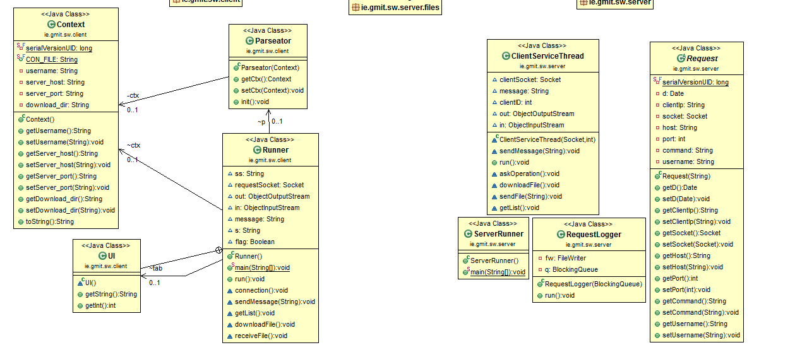

# MultiThreadedServer
You are required to implement a multi-threaded file server and logging application that allows a client application to download files using a set of options presented in a terminal user interface. An overview of the application components is depicted below:

## How to Run
```

```

###UML 
- Here is my uml i got this from a plugin on Eclipse 


 

### Goals Achieved 
```
Get the server to connect to the client and read in IP adderess and port 
Read in a file and recieve it 
exit program and get prompt message 
```
##Conclusion 

As i learned a bit about threads and client and server interaction i could not get the blocking Queue working as i did not fully get the code for it.


